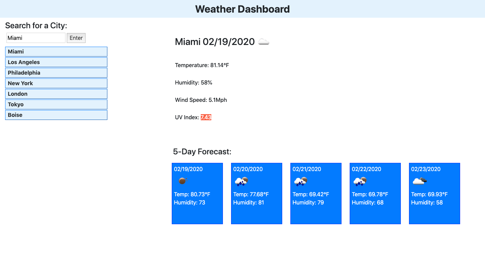

https://jbdunks.github.io/weather/

Created a page that allows the user to enter a city of their choice and returns current weather conditions and the UV index. If the user wishes they may enter a new city and still be able to return to the old city through a generated list. The site also provides a five day forecast for the displayed city.

apparently my last change broke the uv index and i didnt realize.

